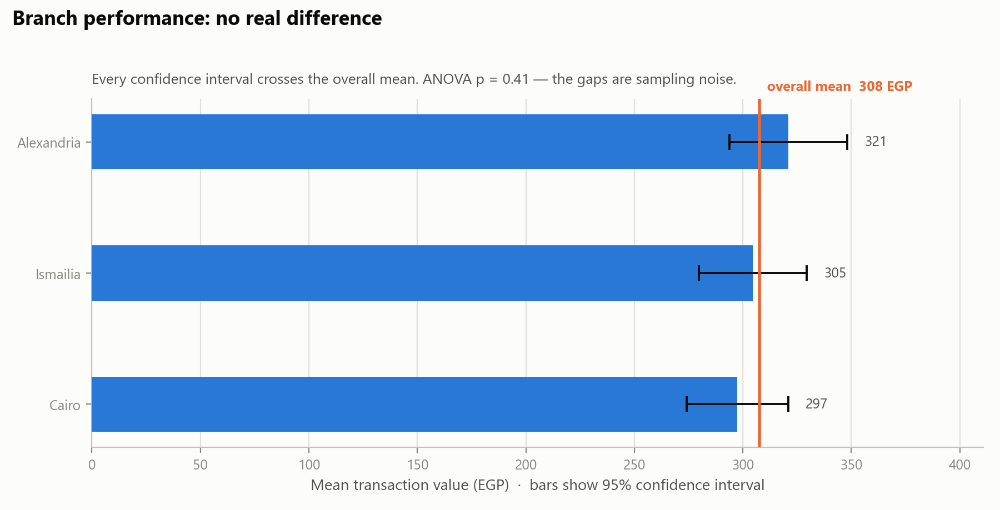
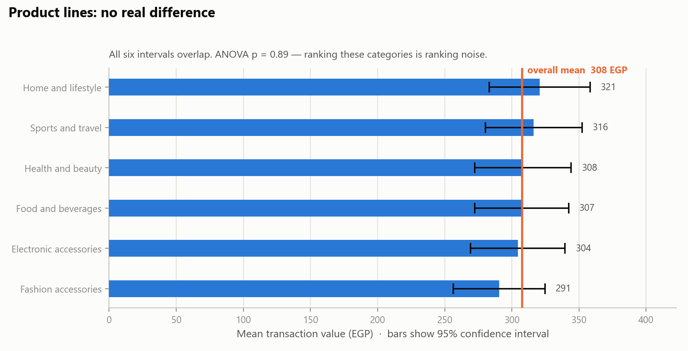
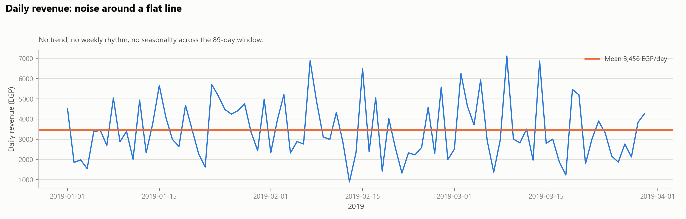
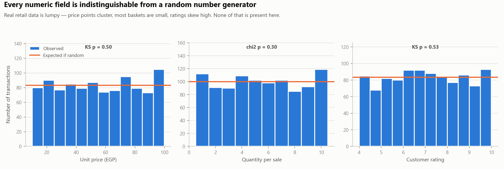

# Supermarket Sales Analysis

Analysis of 1,000 supermarket transactions across three branches, January–March 2019.

---

## Headline finding — read this first

**This dataset is simulated. It is not a record of real trading, and it cannot support business decisions.**

Every numeric field in it is statistically indistinguishable from a random number generator. Every category is evenly balanced. No time pattern exists. Profit margin is a hard-coded constant.

This matters more than any chart below, so it is stated up front: if you rank the product lines by revenue and act on the ranking, **you are acting on random noise.** The full evidence is in [The authenticity problem](#the-authenticity-problem).

The analysis is still presented in full, because the descriptive numbers are correct and the pipeline is reusable. What changes is the conclusion drawn from them.

---

## Dataset at a glance

| | |
|---|---|
| Transactions | 1,000 |
| Period | 1 Jan – 30 Mar 2019 (89 days, every day present) |
| Branches | A · Cairo (340) · B · Ismailia (332) · C · Alexandria (328) |
| Product lines | 6 |
| Net sales | 307,587.38 |
| Gross income | 15,379.37 |
| Total billed | 322,966.75 |
| Average transaction | 307.59 |
| Average basket | 5.51 units |
| Average rating | 6.97 / 10 |

---

## In plain language

No jargon. What the numbers say, and whether you can trust each one.

> **One idea first.** Flip a coin 10 times and you might get 6 heads. That doesn't mean the coin is bent — it's just how chance works. Almost every "difference" below is exactly that: a small gap that showed up by luck. Findings are coloured $\textsf{\color{#0ca30c}green when real}$ and $\textsf{\color{#d03b3b}red when they are only chance}$.

### What sold well, what sold badly

| | Best | Worst | Gap |
|---|---|---|---|
| **Branch** | Alexandria — 105,304 | Ismailia — 101,141 | 4,163 (4.1%) · $\textsf{\color{#d03b3b}just chance}$ |
| **Product range** | Food and beverages — 53,471 | Health and beauty — 46,851 | 6,620 (14.1%) · $\textsf{\color{#d03b3b}just chance}$ |

All three shops took almost exactly the same money. All six product ranges did too — every one landed between 15% and 17% of sales. **Nothing here is a star performer and nothing is a problem area.**

### When customers came, and when they spent

| | When | Sales | Money taken |
|---|---|---|---|
| **Busiest hour** | 7–8 pm | 113 | 37,809 — 12.3% of everything |
| **Quietest hour** | 8–9 pm | 75 | 21,876 — 7.1% |
| **Busiest day** | Saturday | 164 | 53,448 — 17.4% |
| **Quietest day** | Monday | 125 | 36,094 — 11.7% |

Across the day: afternoon (1–4 pm) took **37.8%**, evening (5–8 pm) **35.0%**, morning (10 am–12 pm) **27.2%**. Mornings are the quietest stretch.

The day-of-week pattern is $\textsf{\color{#d03b3b}just chance}$. The hourly pattern is $\textsf{\color{#bf8700}borderline}$ — the closest thing to a genuine signal anywhere in this file, but it still doesn't quite pass the test. **Don't set staffing rotas from it.**

### Happiest and unhappiest customers

- **Highest rated:** Food and beverages 7.11/10 · Alexandria branch 7.07/10
- **Lowest rated:** Home and lifestyle 6.84/10 · Ismailia branch 6.82/10

The whole gap is a quarter of one point — $\textsf{\color{#d03b3b}just chance}$. Everything averages about 7 out of 10. Ratings also have **no connection** to how much people spent — happy customers spent no more than unhappy ones.

### Where is the business losing money?

**This file cannot tell you — and that is the single most important thing in this report.**

There is not one loss anywhere in it. All 1,000 rows are completed sales with positive income. Missing entirely:

- Returns and refunds
- Discounts and markdowns
- Spoiled, expired, or stolen stock
- **What the shop paid for the goods** — so there is no way to know what anything actually cost
- Rent, wages, electricity
- Stock that never sold

"We took 307,587 and lost nothing" is not good news. It means the file records only the good half of the story. It shows what customers were **charged**; it shows nothing about what the shop **paid**. Profit is the difference between those two — and the second number simply isn't here.

### The bottom line, in one sentence

Everything sold roughly equally, at roughly equal margin, to roughly equal numbers of men and women, at roughly every hour of every day — which is not how any real shop behaves, and is why this should be treated as practice data rather than a business record.

---

## Data quality: excellent

The file is technically clean. Nothing needed repairing:

- **No missing values** in any of the 14 columns
- **No duplicate rows**; all 1,000 `invoiceID` values unique
- **Branch ↔ city is a clean 1:1 mapping** — no contradictory records
- **No invalid values** — no zeros or negatives in price, quantity, or rating
- **Complete date coverage** — all 89 days present, no gaps
- **Derived columns verified**: `cost` = `unit_price` × `quantity` reproduces exactly (max difference 0.00)

This is worth separating clearly from the finding above. The data is **well-formed but not real**. Those are different properties, and passing the first says nothing about the second — which is exactly why the checks in `03_authenticity_tests.py` matter.

---

## Descriptive results

### Branch performance



| Branch | City | Transactions | Revenue | Share | Avg txn | Avg rating |
|---|---|---|---|---|---|---|
| C | Alexandria | 328 | 105,303.53 | 34.2% | 321.05 | 7.07 |
| A | Cairo | 340 | 101,143.21 | 32.9% | 297.48 | 7.03 |
| B | Ismailia | 332 | 101,140.64 | 32.9% | 304.64 | 6.82 |

Alexandria appears to lead. **It does not.** One-way ANOVA on transaction value gives *p* = 0.41, and every confidence interval crosses the overall mean. The 4,163 gap between the top and bottom branch is sampling noise. Ratings likewise: *p* = 0.13.

### Product lines



| Product line | Transactions | Revenue | Share | Avg txn | Avg rating |
|---|---|---|---|---|---|
| Food and beverages | 174 | 53,471.28 | 17.4% | 307.31 | 7.11 |
| Sports and travel | 166 | 52,497.93 | 17.1% | 316.25 | 6.92 |
| Electronic accessories | 170 | 51,750.03 | 16.8% | 304.41 | 6.92 |
| Fashion accessories | 178 | 51,719.90 | 16.8% | 290.56 | 7.03 |
| Home and lifestyle | 160 | 51,297.06 | 16.7% | 320.61 | 6.84 |
| Health and beauty | 152 | 46,851.18 | 15.2% | 308.23 | 7.00 |

Six categories spanning 15.2% to 17.4% — that is a nearly perfect even split. ANOVA *p* = 0.89. There is no best-selling category here.

### Customers, gender, payment

| Segment | Split | Avg transaction | Significant? |
|---|---|---|---|
| Member vs Normal | 501 / 499 | 312.18 vs 302.97 | No (*p* = 0.53) |
| Female vs Male | 501 / 499 | 319.14 vs 295.99 | No |
| Cash / eWallet / Credit card | 344 / 345 / 311 | 310.65 / 303.64 / 308.58 | No |

The membership programme shows no measurable effect on spend. In real data that would be an important result. Here it reflects that membership was assigned at random.

### Time



Transaction counts by weekday (*p* = 0.24) and by hour (*p* = 0.05) show no real pattern. February's apparent slump disappears once month length is accounted for:

| Month | Revenue | Days | Revenue/day |
|---|---|---|---|
| 2019-01 | 110,754 | 31 | 3,573 |
| 2019-02 | 92,590 | 28 | 3,307 |
| 2019-03 | 104,243 | 30 | 3,475 |

A 16% headline gap between January and February shrinks to 7% per-day — and that residual is not significant either. **Always normalise for month length before reporting a monthly trend.** This one trap is real and applies to genuine data too.

---

## The authenticity problem

Four independent tests, each pointing the same way.

### 1. Every numeric field is uniform random



| Field | Test | *p* | Observed σ | Uniform σ |
|---|---|---|---|---|
| `unit_price` | KS vs Uniform(10,100) | 0.50 | 26.495 | 25.981 |
| `quantity` | χ² vs uniform 1–10 | 0.30 | — | — |
| `rating` | KS vs Uniform(4,10) | 0.53 | 1.719 | 1.732 |

Real retail data does not look like this. Prices cluster at psychological points (9.99, 19.99). Most baskets hold one or two items, not a flat spread from 1 to 10. Ratings skew high with a long tail. **None of that structure is present.**

### 2. Every category is suspiciously balanced

Member/Normal splits 501/499. Female/Male splits 501/499. Six product lines land within 26 transactions of each other. Real businesses are lopsided — one branch outperforms, one category carries the store. χ² finds no meaningful skew anywhere (*p* = 0.33 to 0.95).

### 3. Margin is a hard-coded constant

`gross income` is **exactly 5.00000000%** of `cost` for all 1,000 rows — zero variance.

This has a direct practical consequence: **margin analysis is impossible with this file.** Every product, branch, and customer type has identical profitability by construction. Any "most profitable category" conclusion is just the revenue ranking restated, and the revenue ranking is itself noise.

### 4. Ratings correlate with nothing

`corr(rating, revenue)` = −0.036 (*p* = 0.25); `corr(rating, quantity)` = −0.016 (*p* = 0.62). Satisfaction is unrelated to what people bought or how much they spent — consistent with ratings drawn independently at random.

### What this dataset actually is

These are the fingerprints of the widely circulated **"Supermarket Sales" teaching dataset**, with city names localised to Egypt. It is designed for practising data manipulation and visualisation — a job it does well. It was never intended as a business record.

---

## What this means for the owner

**Do not use this file to make decisions.** Specifically, do not:

- Rank branches or set branch targets from it
- Choose which product lines to expand or discontinue
- Evaluate the membership programme
- Set staffing from the hourly or weekday profile
- Draw any conclusion about margin

Each would be acting on a random number generator, with false confidence supplied by a professional-looking chart.

**What it is genuinely good for:** practising the analysis pipeline, testing dashboards and BI tooling, teaching, and demoing. The code here runs unchanged against real data with the same column names.

**If you need real answers,** an export from the POS system would need to carry, at minimum:

| Field | Why it matters |
|---|---|
| Actual unit cost per item | The only way to compute real margin — the missing piece here |
| SKU / item-level lines | Product lines are too coarse; basket analysis needs items |
| Customer or loyalty ID | Enables repeat-purchase and retention analysis |
| Discounts and returns | Gross vs net revenue; returns are invisible in this file |
| Stock levels | Separates "didn't sell" from "wasn't on the shelf" |
| A full year | 89 days cannot show seasonality |

With unit cost and SKUs, the same scripts would produce genuine margin and basket analysis.

---

## Data dictionary

| Column | Type | Notes |
|---|---|---|
| `invoiceID` | text | Unique; 1,000 distinct |
| `branch` | category | A, B, C — maps 1:1 to city |
| `city` | category | Cairo, Ismailia, Alexandria |
| `cust_type` | category | Member / Normal |
| `gender` | category | Female / Male |
| `type` | category | Product line (6 values) |
| `unit_price` | float | 10.08 – 99.96 |
| `quantity` | int | 1 – 10 |
| `date` | date | 2019-01-01 → 2019-03-30 |
| `time` | time | 10:00 – 20:59 |
| `payment` | category | Cash / Credit card / eWallet |
| `cost` | float | = `unit_price` × `quantity` |
| `gross income` | float | = exactly 5% of `cost` |
| `rating` | float | 4.0 – 10.0 |

### Two naming problems worth fixing at source

1. **`cost` is misleading.** It holds `unit_price` × `quantity` — that is the *sale value*, what the customer is charged before the 5% addition. It is not a cost of goods. Anyone joining this to a real ledger on the assumption that `cost` means COGS will compute margin backwards. Rename to `line_total` or `net_sales`.

2. **Currency is never stated.** No column, header, or metadata identifies it. Figures here are labelled EGP on the basis of the Egyptian city names — **that is an inference, not a fact from the file.** Confirm before quoting any total.

---

## Reproducing

```bash
pip install -r requirements.txt
```

```bash
python src/01_data_quality.py && python src/02_analysis.py && python src/03_authenticity_tests.py && python src/04_figures.py
```

| Script | Purpose |
|---|---|
| `01_data_quality.py` | Completeness, uniqueness, derived-column verification |
| `02_analysis.py` | Segment analysis, significance test on every comparison |
| `03_authenticity_tests.py` | The four tests behind the headline finding |
| `04_figures.py` | Regenerates all figures in `figures/` |

```
supermarket_analysis/
├── data/supermarket.xls
├── src/
├── figures/
└── README.md
```

---

## Method notes

- Every group comparison carries a significance test. A difference that fails it is reported as noise, not as a finding — which is why this report has fewer "insights" than the dataset superficially offers.
- ANOVA for 3+ group means, Welch's *t*-test for two, χ² for count distributions, Kolmogorov–Smirnov for continuous distribution shape. α = 0.05.
- Charts render on an opaque light background so they stay readable in GitHub's dark theme. The palette is validated for colour-blind separation.
- Figures use direct labels and confidence intervals rather than bare bars, so that overlap — the actual finding — is visible rather than hidden by a ranking.
