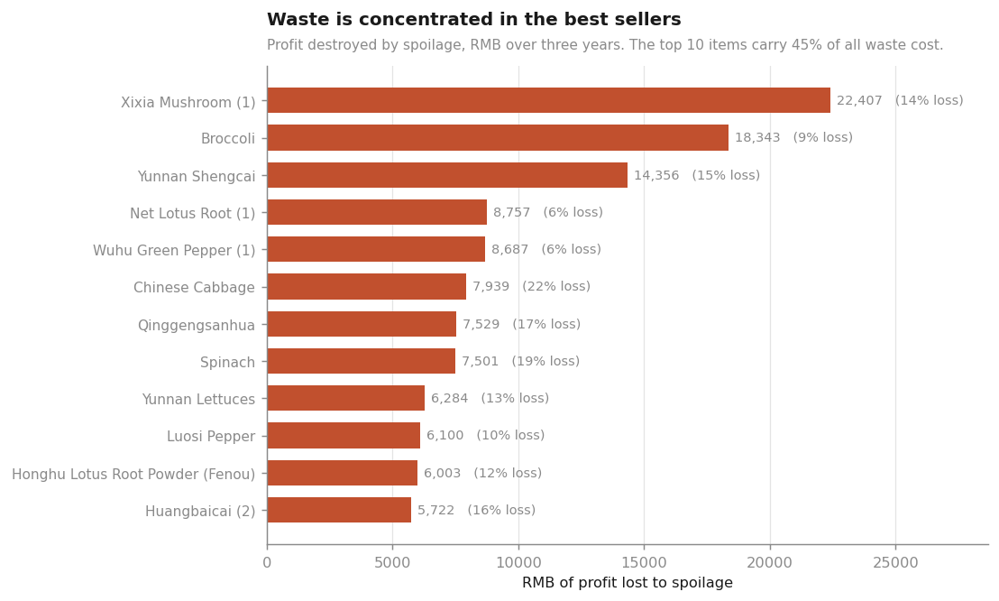
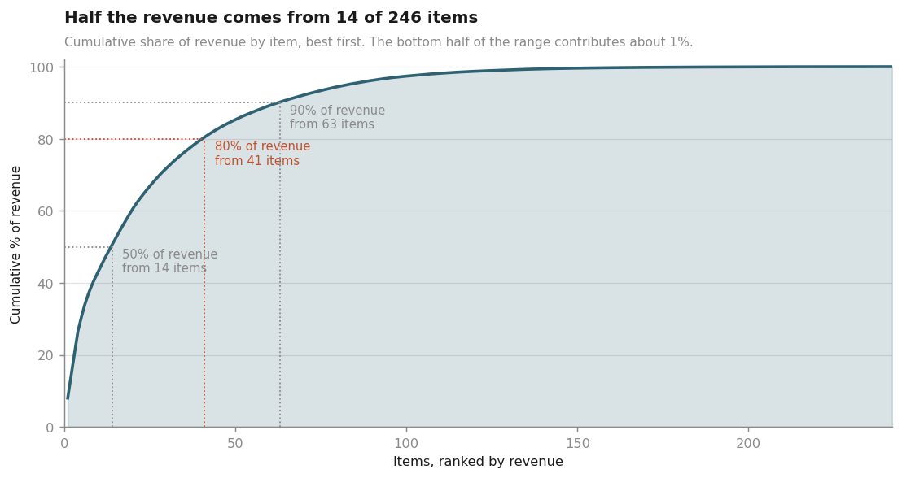
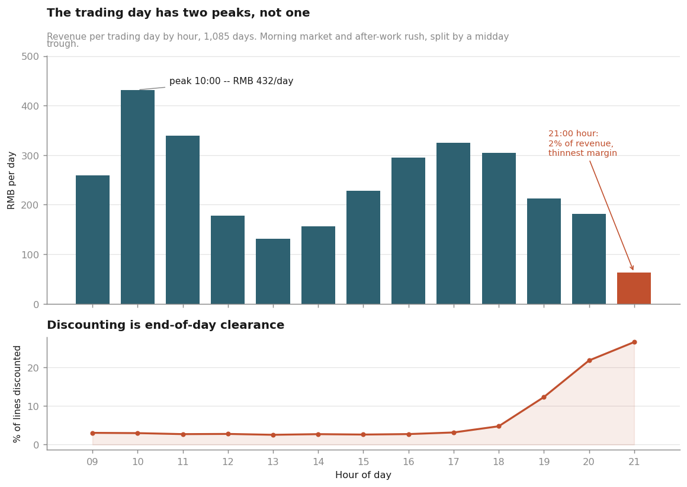
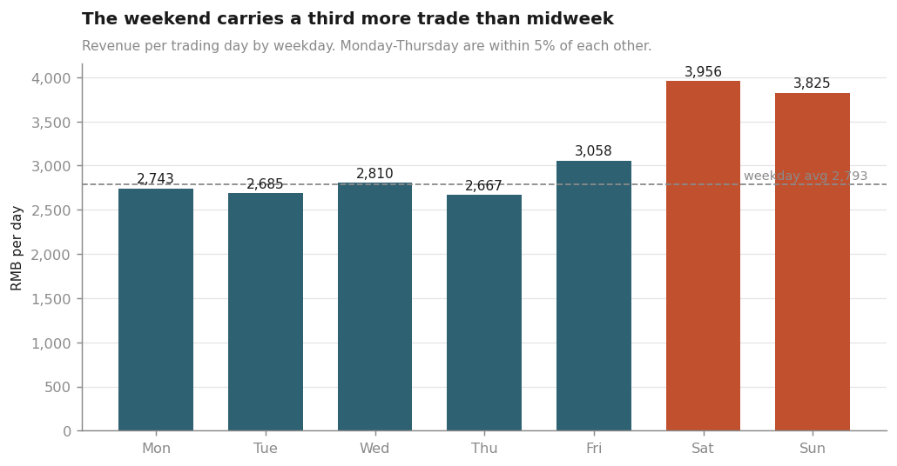
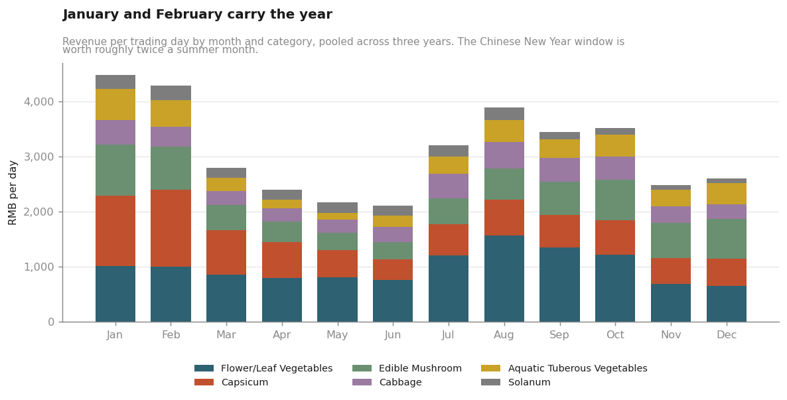
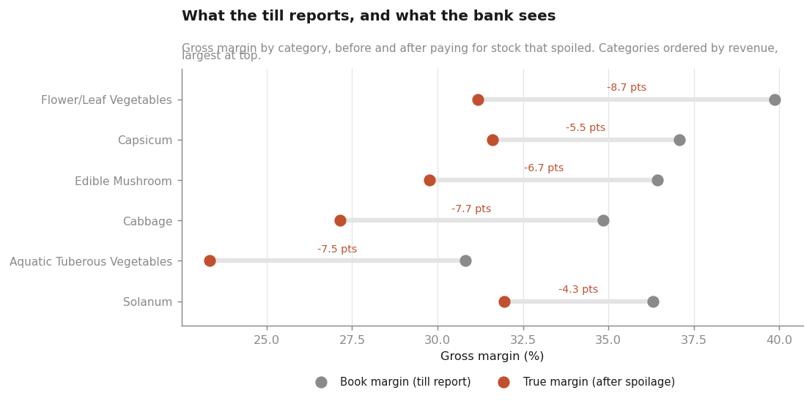
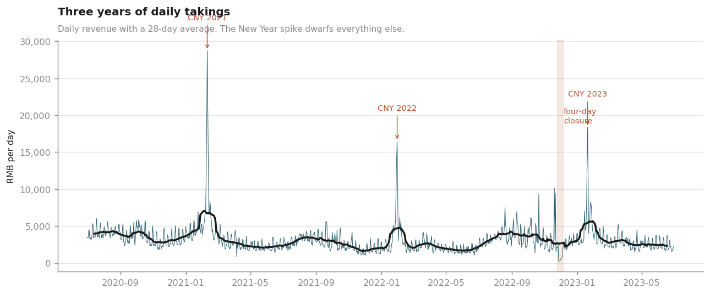

# Annex Chinese Supermarket — three years of a vegetable counter

A full sales, margin and waste analysis of an item-level retail ledger:
**878,503 scanned lines, 251 catalogued items, 1,085 trading days**, from
1 July 2020 to 30 June 2023.

Unlike the simulated [`mutundwe_kampala`](../mutundwe_kampala) dataset in this
repository, **this is a real transaction ledger** — with the gaps, placeholders and
awkward edges that real data has. Several of the more interesting findings below are
about those edges rather than about vegetables.

---

## The finding, in one line

> The business reports a **36.9% gross margin**. Once the stock that spoiled before
> anyone could buy it is paid for, the real figure is **29.8%** — and **RMB 239,699**
> of three-year "profit" turns out never to have existed.

Nothing in a till report will ever show that gap, because a till only sees the kilos
that scanned. It never sees the ones that went in the bin.

---

## Contents

| Path | What it is |
|---|---|
| [`notebooks/analysis_walkthrough.ipynb`](notebooks/analysis_walkthrough.ipynb) | **Start here.** The full method, with outputs and charts rendered inline |
| [`reports/analysis_report.txt`](reports/analysis_report.txt) | The complete 12-section findings report |
| [`reports/findings.json`](reports/findings.json) | Every figure in the report, machine-readable |
| [`src/prepare.py`](src/prepare.py) | Loads and joins the four annexes — the only place joins happen |
| [`src/analyze.py`](src/analyze.py) | The analysis pass; writes the report and the JSON |
| [`src/figures.py`](src/figures.py) | The nine charts |
| [`src/build_notebook.py`](src/build_notebook.py) | Generates the notebook, so it cannot drift from the modules |
| `data/` | The four raw annexes, unmodified |

### Running it

```bash
pip install -r ../requirements.txt
```

```bash
python src/prepare.py && python src/analyze.py && python src/figures.py
```

To regenerate the notebook and re-execute it end to end:

```bash
python src/build_notebook.py && python -m nbconvert --execute --inplace notebooks/analysis_walkthrough.ipynb
```

---

## The data

Four files that each answer part of the question and none of which answer it alone:

| File | Grain | Carries |
|---|---|---|
| `annex1.csv` | one row per item | item name, category (6 categories, 251 items) |
| `annex2.csv` | one row per scanned line | date, time, quantity (kg), unit price, sale/return, discount flag |
| `annex3.csv` | one row per item-day | wholesale cost that day |
| `annex4.csv` | one row per item | loss rate (%) |

**Coverage is unusually good.** All 46,599 sold item-days have a same-day wholesale
quote, so no cost is estimated anywhere in this analysis. That is worth checking
before trusting a margin number, and it is rarer than it sounds.

### The one thing that has to be got right

If an item loses 20% of its stock to spoilage, selling one kilo means *buying* 1.25 kg.
So the true cost of a sold kilo is:

```
true_cost = wholesale_price / (1 - loss_rate)
```

Treating the loss rate as a deduction from margin instead of a multiplier on cost
understates the damage — and understates it worst on exactly the perishable lines
where it matters most. Every margin in this analysis is therefore reported twice:
**book** (what the till shows) and **true** (what the bank sees).

---

## What went wrong

### 1. Footfall is draining away while volume grows

Comparing the first financial year to the third, per trading day:

| | FY20/21 | FY22/23 | Change |
|---|---|---|---|
| Revenue | RMB 3,542 | RMB 3,224 | **−9.0%** |
| Kilos sold | 451 | 536 | **+18.9%** |
| Lines scanned | 957 | 796 | **−16.8%** |
| Price per kg | RMB 7.85 | RMB 6.01 | **−23.4%** |
| Kg per line | 0.47 | 0.67 | **+42.8%** |


The shop moved **19% more produce across 17% fewer transactions**. Each purchase got
43% heavier while price per kilo fell 23%, and takings landed 9% down.

This is not a demand problem — volume grew, and margin percentage actually *improved*
(28.3% → 32.5%). But a revenue-only report would show a business roughly holding
steady, while the transaction count eroded underneath it.

> **What this data cannot say:** whether "fewer lines" means fewer customers or the
> same customers consolidating trips. There is no basket or customer ID in these
> files. Both readings fit, and they call for opposite responses.

### 2. Spoilage is not priced in — anywhere


The correlation between an item's loss rate and its markup is **+0.047**. It stays
near zero at every revenue threshold tested, and turns *negative* at one of them.

An item that bins a quarter of its stock carries the same markup as one that bins none.

**The fix is one formula:** price from `cost / (1 - loss_rate)` rather than from
`cost`, then apply the target margin. On a 25%-loss line that is about a third more
markup than today.

### 3. Waste concentrates in the best sellers, not the worst



Only **2 items** actually flip from profit to loss once spoilage is paid for, and
between them they lose about RMB 21. Framing this as "which products lose money"
finds almost nothing.

The real damage is **RMB 239,699**, spread across the whole book as a 7-point margin
haircut. Markups here average 1.6x — wide enough that spoilage rarely pushes a line
negative. It just quietly takes a fifth of the profit on everything at once.

Because waste is loss rate *times volume*, it lands hardest on the biggest sellers.
**The top 10 items carry 44% of all spoilage cost** — a list short enough to act on
this week.

### 4. Half the range does no work



- **50%** of revenue comes from **14 items** (5.7% of the range)
- **80%** comes from **42 items**
- The **bottom half of the range** contributes **1.2%** of revenue
- **60 items** sold on ten days or fewer in three years
- **110 items** have not sold at all in the final six months

These are not failing products so much as decisions made once and never reviewed.
The payoff from delisting them is not revenue — there is none. It is the ordering
attention and shelf space returned to the top decile, which is volume-constrained
rather than demand-constrained.

### 5. The last trading hour does not pay for itself



The trading day has **two peaks, not one**: a 09:00–11:00 market run and a 16:00–18:00
after-work rush, split by a midday trough at about a third of peak.

The 21:00 hour is **2.0% of revenue at 24.9% margin** — against ~30% through the rest
of the day — and it is the most heavily discounted hour. Weakest on all three measures
at once.

---

## When the money arrives

**By weekday.** The weekend carries a third more trade than midweek — and the gap is
driven by *traffic*, not by bigger baskets: margin is near-identical across all seven
days.



| | Revenue/day | Lines/day |
|---|---|---|
| Saturday (best) | RMB 3,956 | 1,032 |
| Sunday | RMB 3,825 | 998 |
| Thursday (worst) | RMB 2,667 | 699 |

Monday to Thursday sit within 5% of each other. A midweek promotion is competing
with itself rather than filling a genuine trough; the ordering step-up belongs on
Friday and Saturday.

**By month.** January and February carry the year at roughly **2.1x** a June day.



The categories do not move together, which matters for ordering. Aquatic Tuberous
Vegetables swing **4.9x** between peak and trough month; Cabbage only **2.1x**.

## Category performance



Every category loses between 4.3 and 8.7 margin points to spoilage. Flower/Leaf
Vegetables — the largest category at 32% of revenue — loses the most, at **8.7 points**,
because it combines high volume with the highest volume-weighted loss rate (12.5%).

| Category | Revenue share | Book margin | True margin | Lost to waste |
|---|---|---|---|---|
| Flower/Leaf Vegetables | 32.0% | 39.9% | 31.2% | −8.7 pts |
| Capsicum | 22.4% | 37.1% | 31.6% | −5.5 pts |
| Edible Mushroom | 18.4% | 36.4% | 29.8% | −6.7 pts |
| Cabbage | 11.2% | 34.8% | 27.2% | −7.7 pts |
| Aquatic Tuberous Vegetables | 10.4% | 30.8% | 23.3% | −7.5 pts |
| Solanum | 5.7% | 36.3% | 32.0% | −4.3 pts |

---

## What was working better than expected

Not everything here is a problem, and two findings run against the obvious intuition.

**Discounting is not destroying value.** Marked-down stock still returns **+9.7% true
margin**. It is a functioning clearance mechanism recovering cash from stock that would
otherwise be binned at a 100% loss. Discounting runs at 3% of lines before noon and
27% in the 21:00 hour — it is end-of-day clearance, applied at the right time.

The markdown is not the problem. The *volume of stock that needs clearing* is, and
that is a morning ordering decision.

**The year's biggest sales event is completely predictable.** Eight of the ten best
days in three years fall in the week before Chinese New Year, and the best single day
took **10.4x the median day**.



There is no forecasting difficulty here — the date is known years ahead and the shape
repeats in all three years.

---

## What to do

| Action | Why it is the right size of fix |
|---|---|
| Price from `cost / (1 − loss_rate)` | One formula; recovers the single largest leak in the data |
| Attack the top 10 waste items specifically | 44% of waste cost sits in a list short enough to act on this week |
| Put lines/day on the revenue chart | The erosion is invisible on revenue alone |
| Quarterly range review, 90-day delist rule | Returns ordering attention to the volume-constrained lines |
| Split deliveries: heavy pre-09:00, light pre-16:00 | Fixes what *feeds* the evening clearance pile |
| Close at 21:00; move the hour to 09:00–11:00 | A roster change, not an investment |

---

## A data quality problem worth its own section

**85 of the 251 items in `annex4` carry a loss rate of exactly 9.43%** — which is
precisely the mean of that column (9.4267). That is not a measurement. It is a
placeholder written over every item nobody measured. A further **22 items sit at
exactly 0.00%**, which for fresh vegetables is not credible either.

Those 85 items are **16.7% of revenue**. On the loss-rate scatter plot in
["Spoilage is not priced in"](#2-spoilage-is-not-priced-in--anywhere) they form an
unmistakable vertical stripe — the chart labels it directly.

This bounds the analysis without sinking it. The *direction* of every finding survives
— spoilage is unpriced whichever way you cut it, and the aggregate RMB 239,699 is
dominated by high-revenue items that mostly have real measured rates. But **any single
per-item figure for a placeholder line is an assumption wearing two decimal places**,
and should not be taken to the decimal.

---

## Where this analysis stops

Stated plainly, because the limits bound every recommendation above.

- **No basket or customer ID.** Nothing here counts shoppers or measures basket size.
  "Traffic" always means lines scanned.
- **No stock-on-hand.** Spoilage is a per-item rate, not an observed daily loss, so
  this says what waste costs on average — not which delivery went bad.
- **Stockouts are invisible.** An item that sold nothing on a Tuesday may have had no
  demand or no stock. Nothing in these files separates the two, and every "weak seller"
  verdict carries that caveat.
- **The elasticity fits are observational, not experimental.** Price and volume both
  move with supply — a glut lowers price and raises volume at once — so the slopes
  conflate a demand curve with a supply curve. They rank items usefully; they do not
  predict the result of a price change. The notebook shows a block of *positive*
  fitted elasticities that demonstrate the method breaking on fixed-price bagged lines.
- **Everything below gross margin is absent.** No rent, wages, power or transport.
  Gross margin is not profit. This cannot say whether the business makes money — only
  which lines and hours contribute most to covering costs it cannot see.

---

## The words used above, in plain English

**Gross margin** — what is left of the selling price after paying for the goods
themselves, before rent, wages or power. Not profit.

**Book margin** — gross margin measured against what the stock cost to buy. What a
till report shows.

**True margin** — the same figure after also paying for the stock that spoiled. What
the bank sees.

**Loss rate** — the share of stock that spoils or is thrown away before it can be sold.

**SKU** — one distinct sellable item.

**Markup** — selling price divided by cost. A 1.6x markup on a RMB 5 kilo means RMB 8.

**Elasticity** — how much volume moves when price moves. −1.5 means a 10% price rise
costs about 15% of volume.

**Line** — one scanned item on one receipt. Not a customer and not a basket.
