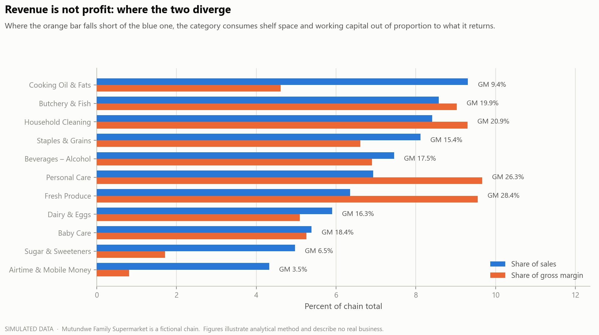
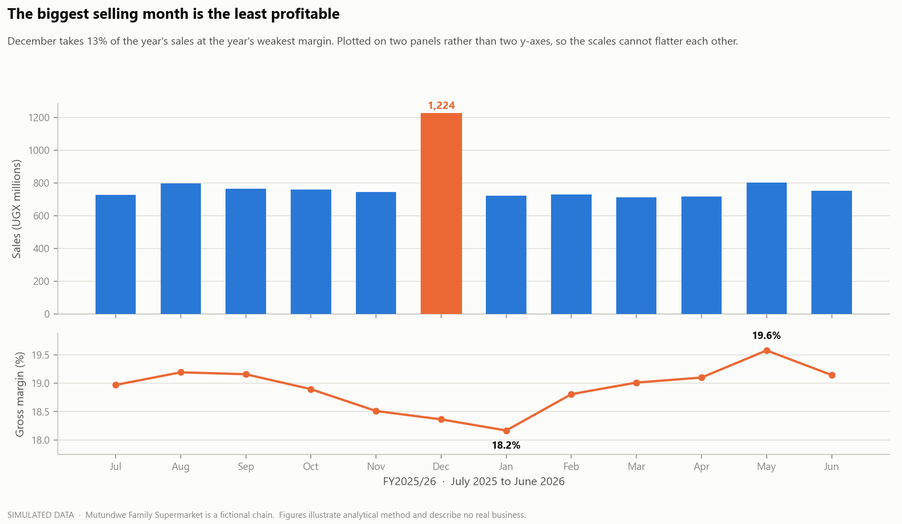
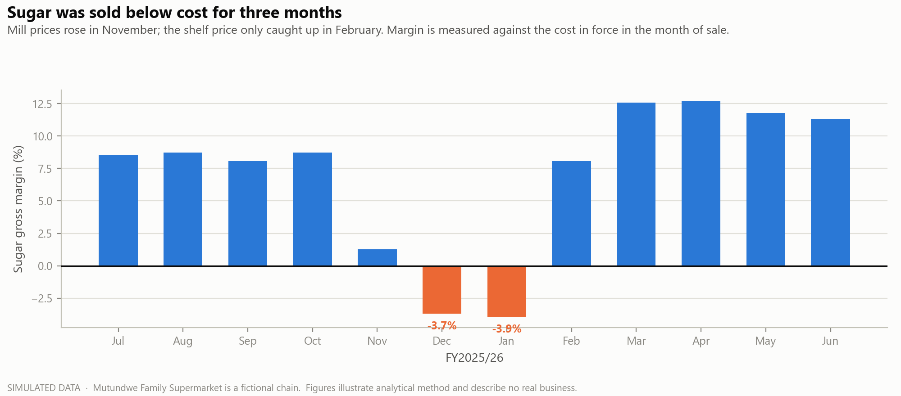
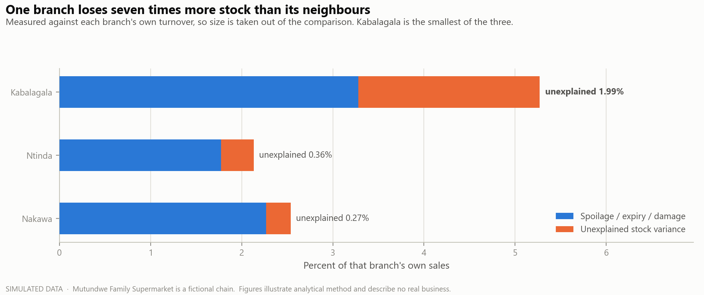
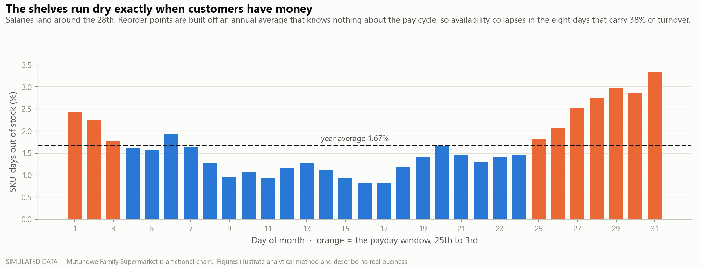
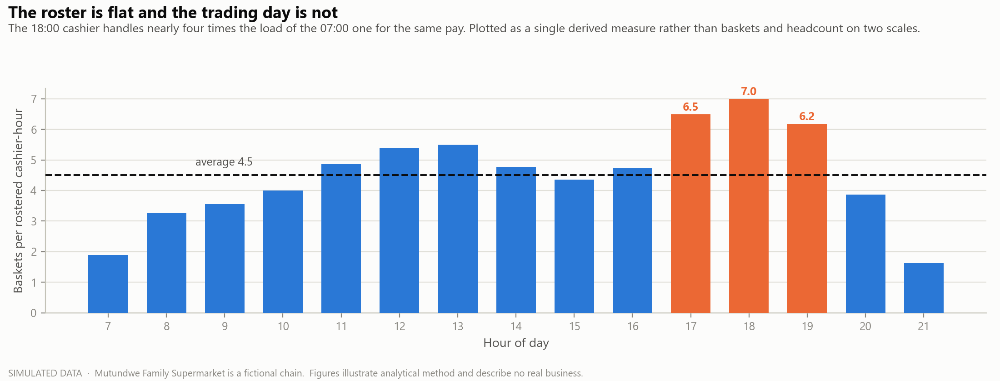

# Mutundwe Family Supermarket — a Kampala POS dataset

A simulated one-year point-of-sale and inventory dataset for a three-branch supermarket
chain in Kampala, Uganda, with the full analysis over it.

---

## Read this first

**Every figure in this folder is invented. Mutundwe Family Supermarket does not exist.**

No transaction here happened, no branch is real, and no named till operator is a person.
Real distributor and brand names (Mukwano, Kakira, Ntake, Century Bottling, Movit) are used
so the product range is recognisable to a Ugandan reader — **nothing here reflects the actual
performance of any named company.**

The dataset was generated from a fixed random seed by [`src/generate_data.py`](src/generate_data.py).
Its purpose is to demonstrate analytical method on data that behaves the way a Ugandan
supermarket actually behaves. It is not a business record and cannot support a business decision.

---

## Why this folder exists

The parent analysis in this repository ends by listing what a POS export *would* need to carry
before it could answer real questions. This dataset was built to carry exactly those things.

| The parent README asked for | Here |
|---|---|
| Actual unit cost per item | `price_history.csv` — cost in force **at the date of sale**, not today's cost |
| SKU / item-level lines | 354 SKUs across 1,306,279 line items |
| Customer or loyalty ID | 14,200 customers, 38% of baskets identified |
| Discounts and returns | `discount_ugx` per line; returns posted as negative lines days later |
| Stock levels | Daily closing stock per SKU per branch, with stockout flags |
| A full year | 365 days — Uganda's FY2025/26, 1 Jul 2025 to 30 Jun 2026 |

### What that makes it complete for

> **This is everything needed for a full sales, margin, stock and shrinkage analysis.**

Every question the parent dataset had to decline — what a product actually earns, what sells with
what, what an empty shelf costs, where stock disappears, which supplier causes it — is answerable
here, end to end, from the data alone.

That is a deliberately scoped claim, and it is the honest one. It is not "everything a supermarket
needs." The line where it stops is gross margin.

### Where it stops

Closing those six gaps does not make the dataset complete, because everything **below** gross margin
is absent. It supports a sales-and-stock analysis, not a profitability one.

| Still missing | What it would unlock |
|---|---|
| Rent, wages, power, generator fuel, licences, insurance | Gross margin is not profit. The data shows Kabalagala at 18.2% GM but cannot say whether that covers its rent — so "is this branch worth keeping?" is unanswerable |
| Wage rates per staff hour | Turns "7 baskets per cashier-hour" into "labour cost per basket", which is the number that actually decides a roster |
| Footfall / door counts | Conversion rate. We count people who *bought*; without a door counter, a −12.5% rainy day could be fewer visitors or smaller baskets, and there is no way to tell which |
| Shelf space in linear metres | Margin per metre — the real currency of a range review. We can show cooking oil is low-margin, not whether it earns its facings |
| Till cash-up: declared vs expected cash | Void rate is circumstantial. A cash variance on the same till on the same shift is evidence |
| Competitor price checks on known-value items | KVI pricing is half-blind without knowing what the shop next door charges for sugar and oil |
| Two to three years of history | One year cannot separate trend from seasonality. Was December 2025 strong, or just a normal December? |

---

## What makes it Ugandan rather than generic

The seasonality is local, and it is the part most retail datasets get wrong.

- **Payday, not the calendar month.** Salaries land around the 28th. The 25th–3rd window is 31% of the days and **38% of the turnover.**
- **Three school terms**, not one back-to-school. Half the year's stationery sells in three months.
- **Ramadan and both Eids**, which move each year and shift the basket — staples and soft drinks up, alcohol down.
- **The January 2026 general election.** Households stocked up 4% above baseline the week before; trade then fell **57%** during the week of the vote.
- **Two rainy seasons.** Rainy days trade 12.5% below dry days.
- **Load shedding.** Outage days cost roughly UGX 691,000 in cold-chain stock.
- **EFRIS** fiscalisation, VAT-exempt unprocessed foods versus standard-rated packaged goods, mobile money at 37% of tender and climbing, and local distributors with real lead times, fill rates and credit terms.

---

## Defects left in on purpose

A real back-office export is not clean, and an analysis has to survive that. These are deliberate:

- **Voided tickets remain in the file**, and `transaction_lines.csv` carries **no void flag** — you must join to the header. Summing the line table raw overstates turnover by UGX 122.7m.
- **Returns are negative-quantity lines**, posted a few days after the original sale.
- **Airtime and Yaka are booked at face value**, dragging blended margin from 19.6% down to 18.9% and hiding how the grocery business is really performing.
- **Stockouts leave no trace in the POS.** A sale that never happened has no row.

---

## Headline numbers

| | |
|---|---|
| Turnover | UGX 9.46bn |
| Gross margin | 18.9% — 19.6% excluding airtime |
| Baskets | 288,007 · 263 per branch per day |
| Average basket | UGX 32,890 · 4.7 items |
| Shrinkage | 3.1% of sales |
| Inventory / supplier credit | 10.6 days vs 16.5 days — a −6 day cash conversion cycle |

---

## Findings

### Revenue is not profit



Cooking oil is the single largest line on the sales report and returns less than half its share
of the margin. Fresh produce is two-thirds the size and returns half again as much. Airtime is
4.3% of what the sales report calls turnover and 0.8% of the margin, because a UGX 10,000 top-up
earns about UGX 350 — it belongs in a separate report as commission income, not in the sales line.

### The biggest selling month is the least profitable



December takes 13% of the year in one month, at the year's weakest margin. Plotted on two panels
rather than two y-axes, so the scales cannot be made to flatter each other.

### Sugar was sold below cost for three months



Mill prices moved in November; the shelf price only caught up in February. For twelve weeks over
the busiest trading period of the year, sugar carried a negative gross margin.

Sugar is a known-value item, so absorbing a squeeze to protect footfall is a legitimate strategy —
but it has to be a decision made in November, not a discovery made in June. Cost is measured
against the price in force in the month of sale; using today's cost makes this invisible.

### One branch loses seven times more stock than its neighbours



Measured against each branch's own turnover, so size is removed from the comparison. Kabalagala is
the **smallest** of the three and carries 1.99% unexplained variance against 0.27% at Nakawa.

The loss is concentrated in small, high-value lines — spirits, personal care, baby formula. Two
further signals point at the same branch: one till voids 7.4% of its tickets against a 1.1% chain
median, rising to 10.1% after 18:00, and fiscalises only 74% of tickets on EFRIS against a 97% median.

Three independent signals converging on one till on one shift is what an exception report is for.
It is not an accusation — it says where to put a supervisor and a stock count for two weeks.

### The shelves run dry exactly when customers have money



UGX 455m of demand — 4.8% of turnover — went unserved. It is invisible in the till roll, because a
sale that never happened leaves no record; it appears only when sales are joined to daily stock.

The cause is mechanical: reorder points are built off an annual average that knows nothing about
the pay cycle, so availability collapses in the eight days carrying 38% of the turnover.

### The roster is flat and the trading day is not



The 18:00 cashier handles nearly four times the load of the 07:00 one, for the same pay. The same
flatness runs through the month: 5.1 baskets per cashier-hour in the payday window against 4.3
through the rest of it.

Plotted as a single derived measure rather than baskets and headcount on two scales — a dual-axis
chart here would make almost any roster look defensible.

### Promotions

Twelve promotions ran. Split by who funded the discount, the pattern is not subtle: the five the
shop funded itself lost **UGX 2.31m** between them; the six with real supplier funding made
**UGX 0.57m**.

One promotion moved 22% more rice and still lost money — it discounted rice at Christmas to people
who would have bought rice at Christmas. Volume lift and incremental margin are different
questions, and supplier funding is the field that decides the answer. It is almost never in the POS.

---

## Reproducing

The generated data is **not committed** — it is 167 MB, and `transaction_lines.csv` alone is 93 MB,
past the point where GitHub warns. It is fully reproducible from a fixed seed instead:

```bash
pip install pandas numpy matplotlib
```

```bash
python src/generate_data.py && python src/analyze.py && python src/figures.py
```

Generation takes a few minutes and is deterministic (`SEED = 20260811`) — the same numbers quoted
above will come out every time.

| Script | Purpose |
|---|---|
| `src/catalog.py` | Master data: 354 SKUs, 35 distributors, 3 branches, case packs, VAT status |
| `src/generate_data.py` | Demand model → inventory simulation → basket construction |
| `src/analyze.py` | 17-section analysis; writes `reports/findings.json` |
| `src/figures.py` | Regenerates every figure in `figures/` |

```
mutundwe_kampala/
├── src/          generator and analysis
├── figures/      committed PNGs used above
├── reports/      findings.json, full text report, HTML briefing / dashboard / glossary
└── data/         generated, gitignored
```

### Generated files

| File | Rows | What it is |
|---|---|---|
| `transactions.csv` | ~294k | Ticket headers — tender, cashier, till, EFRIS flag, void flag |
| `transaction_lines.csv` | ~1.3m | Line items with unit cost and price as at the date of sale |
| `inventory_daily.csv` | ~349k | Branch × SKU × day: closing stock, receipts, waste, stockout flag |
| `lost_sales.csv` | ~14k | Ground truth for demand lost to empty shelves |
| `shrinkage.csv` | ~128k | Spoilage, damage and unexplained variance, split by reason |
| `purchase_orders.csv` | ~26k | Orders against receipts — gives real supplier fill rates |
| `price_history.csv` | 4,248 | Monthly cost and price per SKU |
| `products.csv` · `suppliers.csv` · `branches.csv` | 354 · 35 · 3 | Master data |
| `calendar.csv` | 365 | Local demand drivers — payday, terms, holidays, rain, outages, election |
| `promotions.csv` | 12 | Promo calendar **including supplier funding share** |
| `customers.csv` · `staff.csv` · `staff_shifts.csv` | 14,200 · 40 · 16,425 | Loyalty base and rostered cashier-hours |

---

## Method notes

- Voided tickets are stripped from **both** the header and the line table before any total is computed.
- Returns are netted off revenue but excluded from basket counts.
- Airtime and Yaka are reported separately from retail, because booking a UGX 10,000 top-up as
  UGX 10,000 of sales wrecks every margin percentage in the business.
- Margin is always measured against the cost in force in the month of sale.
- Lost sales are **ground truth here**, because the generator knows the demand it suppressed. On real
  client data this figure has to be *estimated* from pre-stockout velocity — a good estimate, not a
  measurement, and it should be presented as such.
- Charts render on an opaque light surface so they stay readable in GitHub's dark theme, and reuse
  the parent project's CVD-validated palette.
- **Assumed values, flagged wherever they appear:** payment-processing rates (0.35% cash handling,
  1.0% mobile money, 3.0% card MDR) are placeholders pending real merchant agreements. VAT treatment
  is modelled — unprocessed foods exempt, packaged goods standard-rated — and the treatment of
  specific lines is worth confirming with an accountant rather than assuming.

---

## Problems planted in the data

Each is produced by a mechanism in the generator rather than asserted, so the analysis genuinely has
to find it. Listed here so the dataset can be used as a teaching set with a known answer key.

| Planted | Mechanism | Surfaces as |
|---|---|---|
| Month-end stockouts | Reorder points built off the annual average | 2.4% vs 1.3% SKU-days out |
| Branch control problem | Elevated loss rate on small high-value lines at one branch | 1.99% of sales vs 0.27% |
| One suspect till | Higher void and lower EFRIS rate, worse after 18:00 | 7.4% voids vs 1.1% median |
| Commodity price lag | Cost index moves in November, price index lags to February | Three months of negative margin |
| Self-funded promos lose money | Supplier rebate modelled as reduced effective cost | −UGX 2.31m vs +UGX 0.57m |
| Dead stock | Case-pack rounding plus a shelf-facing minimum | 89 SKUs, 5% of sales, UGX 19m of stock |
| Cold-chain waste | Outage hours multiply spoilage on chilled lines | UGX 691k per outage day |
| Flat roster | Rostered cashiers deliberately not demand-matched | 7.0 vs 1.9 baskets per cashier-hour |
